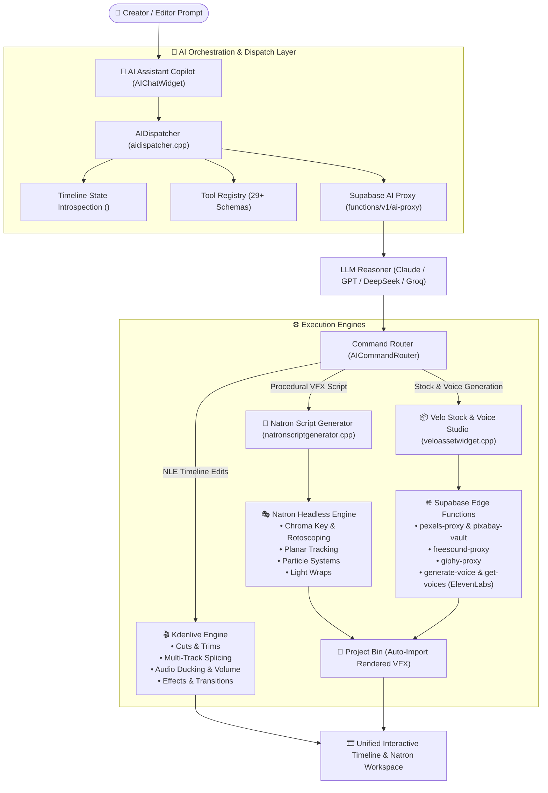

# 🎬 VidMate.ai (AI-Mate)

> **The Next-Generation AI-Native Video Editor & VFX Compositor**  
> Unifying **Kdenlive's Multi-Track NLE**, **Natron's Node-Graph OpenFX Compositor**, and **Velo's Autonomous AI Orchestration Harness**.

---

## 🌟 Overview

Video editing is traditionally one of the most time-consuming and tedious creative workflows. Sifting through hours of raw footage, trimming dead air, hunting for matching B-roll, generating transcripts, color grading, sound design, and building complex visual effects often creates severe bottlenecks for creators and production studios.

**VidMate.ai** solves this by fusing a production-grade non-linear editor with a node-based compositor and an autonomous multi-modal AI director:

- 🎞️ **Kdenlive NLE Core**: Robust multi-track timeline, ripple trimming, transitions, audio mixing, subtitle sync, and MLT rendering engine.
- 🎭 **Natron OpenFX Compositor Workspace**: Full node-graph compositing, Bézier curve tangent editor, and multi-track dope sheet retimer tabbed directly alongside the NLE timeline.
- 🤖 **Autonomous AI Editing Harness**: Natural language direction translating high-level creative prompts into native NLE cuts, smart B-roll splices, automatic audio ducking, and procedural Natron Python VFX scripts.
- 📦 **Multi-Provider Stock & Voiceover Studio**: Built-in 4K video/photo search (Pexels, Pixabay), sound effects (Freesound), GIFs (Giphy), and realistic human speech synthesis (ElevenLabs) powered by Supabase edge functions.
- 🎯 **SAM2 Intelligent Object Segmentation**: Meta Segment Anything Model 2 integration for instant rotoscoping, point tracking, and automated masking.

---

## 🏗️ Architecture



---

## ✨ Key Features

### 1. 🤖 Conversational & Autonomous AI Copilot
- Direct your edits using plain English or any language:
  - *"Cut all dead air pauses longer than 200ms and zoom in slightly on emphatic sentences."*
  - *"Find dramatic drone footage of mountain ranges, insert at playhead, and add a cinematic whoosh sound effect."*
  - *"Generate an ElevenLabs voiceover with Rachel's voice explaining the intro script."*
- Full `<editor_state>` timeline introspection: The AI inspects playhead positions, selected clips, in/out zones, track layouts, and speech transcripts before applying edits.
- Atomic undo/redo: Multi-step AI proposals execute inside transactional undo macros for risk-free editing.

### 2. 🎭 Natron Node-Graph Compositor Integration
- Tabbed directly with the timeline scrubber for instant toggling between timeline editing and node compositing:
  - **NodeGraphView**: Interactive node graph with pan/zoom, node dragging, pin connection lines, and real-time inspector properties.
  - **CurveEditorView**: Interactive Bézier function curves, control points, and tangent handles.
  - **DopeSheetView**: Multi-track keyframe block retimer and frame scrubber.
- Procedural Python script generator executes headless VFX pipelines in the background and auto-imports rendered sequences into Kdenlive's Project Bin.

### 3. 📦 Stock Media & Voiceover Studio (<kbd>Ctrl</kbd>+<kbd>Alt</kbd>+<kbd>A</kbd>)
- **Stock Footage & Photos**: Interleaved search across Pexels and Pixabay with direct HD/4K preview and download.
- **Sound Effects (SFX)**: Search and preview high-fidelity audio assets from Freesound.
- **Animated GIFs & Memes**: Giphy trending and search integration.
- **Voiceover Studio**: ElevenLabs text-to-speech synthesis with real-time voice discovery (`get-voices`), speed, stability, and similarity sliders.
- **One-Click Ingestion**: Download, import to Project Bin, and splice onto timeline tracks at the playhead in one step.

### 4. 🎯 Segment Anything (SAM2) Auto-Masking
- Integrated SAM2 neural segmentation for object detection, keyframe tracking, and automated alpha mattes.
- Automatic fallback discovery for system Python environments.

### 5. 👤 1-Click Human Background Removal & Video Matting (RVM)
- Deep neural matting powered by **RobustVideoMatting (RVM)** ONNX inference for human subject extraction.
- **Zero-Prompt 1-Click Matting**: Automatically isolates people and fine hair strands with zero manual bounding boxes or stroke prompts needed.
- **Dynamic Resolution Optimization**: Automatically balances internal downsample ratios to preserve sub-pixel edge fidelity across low-res images and 4K footage alike.
- **Direct Mask & Cutout Generation**: Emits both high-precision 8-bit alpha matte sequences (`mask_000000.png`) and transparent RGBA cutouts (`cutout_000000.png`) for instant drag-and-drop timeline layering or Natron node graph compositing.

#### 🌟 Matting Quality Showcase
| Original Input (`human_input.png`) | Alpha Matte (`mask_000000.png`) | Transparent Cutout (`cutout_000000.png`) |
| :---: | :---: | :---: |
|  |  |  |

---

## 🚀 Getting Started

### Prerequisites
- **OS**: Linux (Ubuntu 22.04+, Debian 12+, Arch, Fedora)
- **Build Tools**: CMake 3.22+, Ninja, GCC/Clang (C++20 support)
- **Libraries**: Qt 6.6+, KDE Frameworks 6 (KF6), MLT 7 framework, FFmpeg
- **Python**: Python 3.10+ (with `requests`, `numpy`, `torch` optional for SAM2)

### 1. Clone & Configure Environment
```bash
# Clone the repository
git clone https://github.com/lincolnpaul-devEng/vidmate.ai-mate.git
cd vidmate.ai-mate/kdenlive

# Configure your API credentials
cp .env.example .env.local
```

Edit `.env.local` to specify your Supabase and LLM endpoints:
```env
# Supabase Edge Functions & Storage
SUPABASE_URL=https://<your-project-ref>.supabase.co
SUPABASE_ANON_KEY=eyJhbGciOiJIUzI1NiIsInR5cCI6...
SUPABASE_SERVICE_ROLE_KEY=eyJhbGciOiJIUzI1NiIsInR5cCI6...

# Optional Direct LLM API Keys (or use Supabase ai-proxy)
LLM_PROVIDER=anthropic
LLM_ANTHROPIC_API_KEY=sk-ant-...
ELEVENLABS_API_KEY=...
```

### 2. Build Kdenlive with AI Harness & Natron Workspace
```bash
# Configure build directory
cmake -B build -S . -G Ninja \
    -DCMAKE_BUILD_TYPE=RelWithDebInfo \
    -DBUILD_TESTING=OFF

# Compile executable
ninja -C build bin/kdenlive
```

### 3. Launch VidMate.ai
```bash
./build/bin/kdenlive
```

---

## 🛠️ AI Tool Reference

| Tool Category | Tool Name | Description |
| :--- | :--- | :--- |
| **Timeline Cuts** | `cut_at_playhead` | Razor cut clips across active or all tracks at playhead |
| **Timeline Trimming**| `trim_clip` | Adjust in/out points with ripple edit modes |
| **Arrangement** | `move_clip`, `set_clip_speed` | Retime clips (slow-motion, 2x speed) and move across tracks |
| **Audio Mixing** | `set_volume`, `audio_ducking` | Auto-duck background music during dialogue |
| **Silence Removal** | `remove_silence` | Auto-detect and trim pauses >150ms based on transcript |
| **Compositing** | `natron_vfx` | Procedurally launch Natron node graph VFX pipeline |
| **Stock Media** | `search_stock_media` | Query Pexels, Pixabay, Giphy, and Freesound |
| **Speech Synthesis**| `generate_voiceover` | Synthesize ElevenLabs neural speech and add to audio track |
| **Media Ingest** | `insert_media_url` | Download remote asset, import to Bin, and insert to timeline |
| **Inspection** | `get_timeline_state`, `view_timeline_frames` | Snapshot timeline status and capture video verification frames |

---

## ⌨️ Quick Shortcuts

- <kbd>Ctrl</kbd> + <kbd>Alt</kbd> + <kbd>A</kbd>: Open / Focus **Velo Stock Media & AI Voiceover Studio**
- <kbd>Ctrl</kbd> + <kbd>Z</kbd> / <kbd>Ctrl</kbd> + <kbd>Shift</kbd> + <kbd>Z</kbd>: Undo / Redo (supports atomic AI proposals)
- <kbd>Space</kbd>: Play / Pause Timeline
- <kbd>Shift</kbd> + <kbd>R</kbd>: Razor / Cut at Playhead

---

## 📜 License

VidMate.ai is open-source software licensed under the **GPL-3.0-only OR LicenseRef-KDE-Accepted-GPL**.
See the [LICENSE](file:///home/lincoln/vidmate.ai-mate/kdenlive/LICENSE) file for more information.
